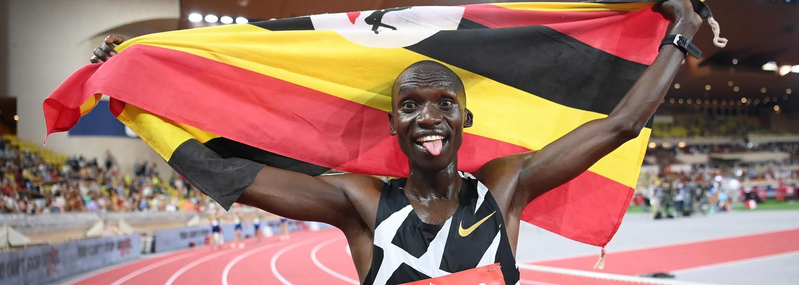

# Joshua Cheptegei

|          中文名          |                       约书亚·切普特盖                        |
| :----------------------: | :----------------------------------------------------------: |
|       **代表国家**       |                          **乌干达**                          |
|      **出生年月日**      |                        **1996.09.12**                        |
| **世界田联的运动员主页** | **[Joshua Cheptegei \| Profile \| World Athletics](https://worldathletics.org/athletes/uganda/joshua-cheptegei-14645612)** |

**奥运会🥇 x2**

**世锦赛🥇 x3**

**奥运会🥈 x1**

**世锦赛🥈 x1**

> ⚠前排提醒最好使用电脑端观看，如果使用手机观看，请使用浏览器的电脑模式/桌面模式

# [个人最佳](./Personal-Best.md) | [荣誉列举](./Honors.md) | [成绩汇总](./Results.md) | [常用统计](./Stats.md)