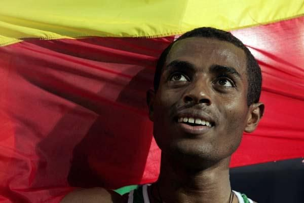

# Kenenisa Bekele

|          中文名          |                       凯内尼萨·贝克勒                        |
| :----------------------: | :----------------------------------------------------------: |
|       **代表国家**       |                        **埃塞俄比亚**                        |
|      **出生年月日**      |                        **1982.06.13**                        |
|       **主要项目**       |                 **5000米、10000米、马拉松**                  |
| **世界田联的运动员主页** | **[Kenenisa Bekele \| Profile \| World Athletics](https://worldathletics.org/athletes/ethiopia/kenenisa-bekele-14181357)** |

**奥运会🥇 x3**

**世锦赛🥇 x5**

**奥运会🥈 x1**

**世锦赛🥉 x1**

**生涯 世界纪录 & 世界最好成绩 次数 x6**

# [个人最佳](./Personal-Best.md) | [荣誉列举](./Honors.md) | [成绩汇总](./Results.md) | [厚度统计](./Stats.md)

# [首页](../../../../README.md)