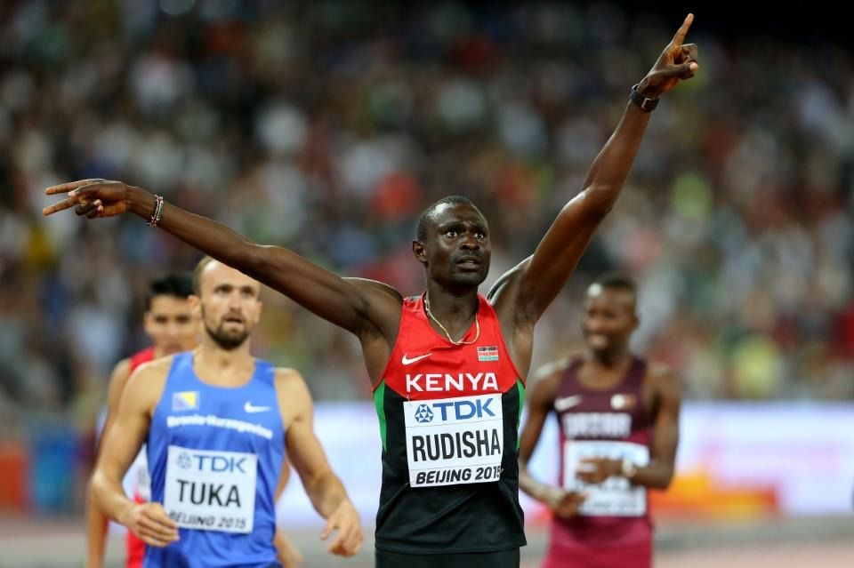

# David Rudisha

|          中文名          |                         大卫·鲁迪沙                          |
| :----------------------: | :----------------------------------------------------------: |
|       **代表国家**       |                          **肯尼亚**                          |
|      **出生年月日**      |                        **1988.12.17**                        |
|       **主要项目**       |                          **800米**                           |
| **世界田联的运动员主页** | **[David Rudisha \| Profile \| World Athletics](https://worldathletics.org/athletes/kenya/david-rudisha-14209691)** |

**奥运会🥇 x2**

**世锦赛🥇 x2**

**钻石联赛总决赛冠军💎 x2**

**国际田联洲际杯冠军 x1**

**生涯 世界纪录 & 世界最好成绩 次数 x3**

# [个人最佳](./Personal-Best.md) | [荣誉列举](./Honors.md) | [成绩汇总](./Results.md) | [厚度统计](./Stats.md)

# [首页](../../../../README.md)
