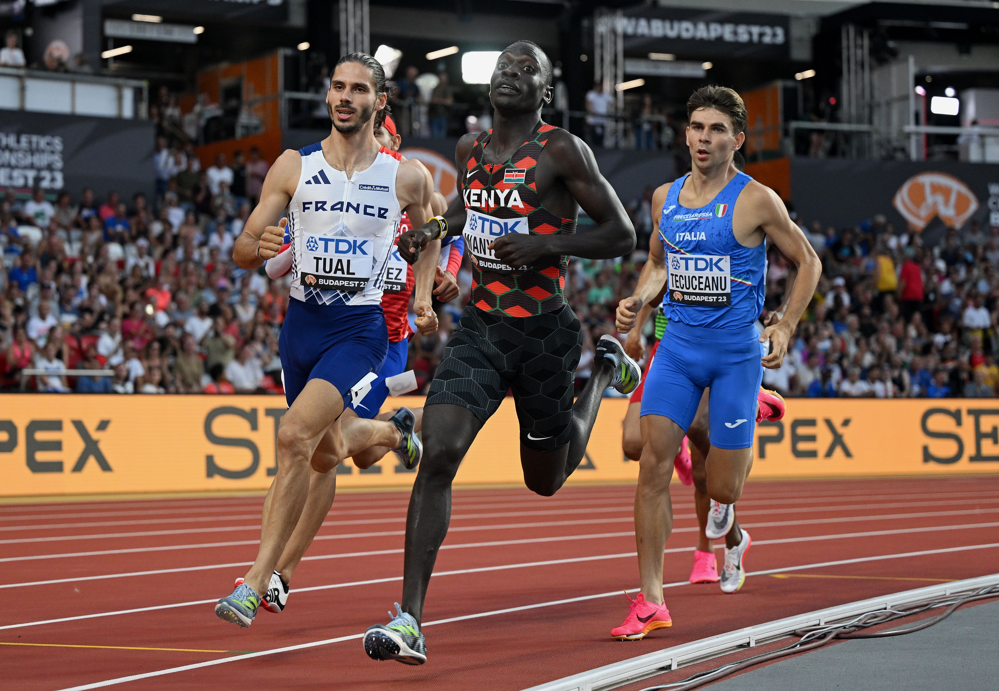

# Emmanuel Wanyonyi

|          中文名          |                       伊曼纽尔·万永伊                        |
| :----------------------: | :----------------------------------------------------------: |
|       **代表国家**       |                          **肯尼亚**                          |
|      **出生年月日**      |                        **2004.08.01**                        |
|      **运动员代码**      |                         **14974928**                         |
| **世界田联的运动员主页** | **[Emmanuel Wanyonyi \| Profile \| World Athletics](https://worldathletics.org/athletes/kenya/emmanuel-wanyonyi-14974928)** |
|       **社交账号**       |                  **[Instagram]() \| [X]()**                  |

**奥运会🥇 x1**

**世锦赛🥈 x1**

**世锦赛前八 x1**

**钻石联赛总决赛冠军💎 x2**

> ⚠前排提醒最好使用电脑端观看，如果使用手机观看，请使用浏览器的电脑模式/桌面模式

# [个人最佳](./Personal-Best.md) | [荣誉列举](./Honors.md) | [成绩汇总](./Results.md) | [常用统计](./Stats.md)

