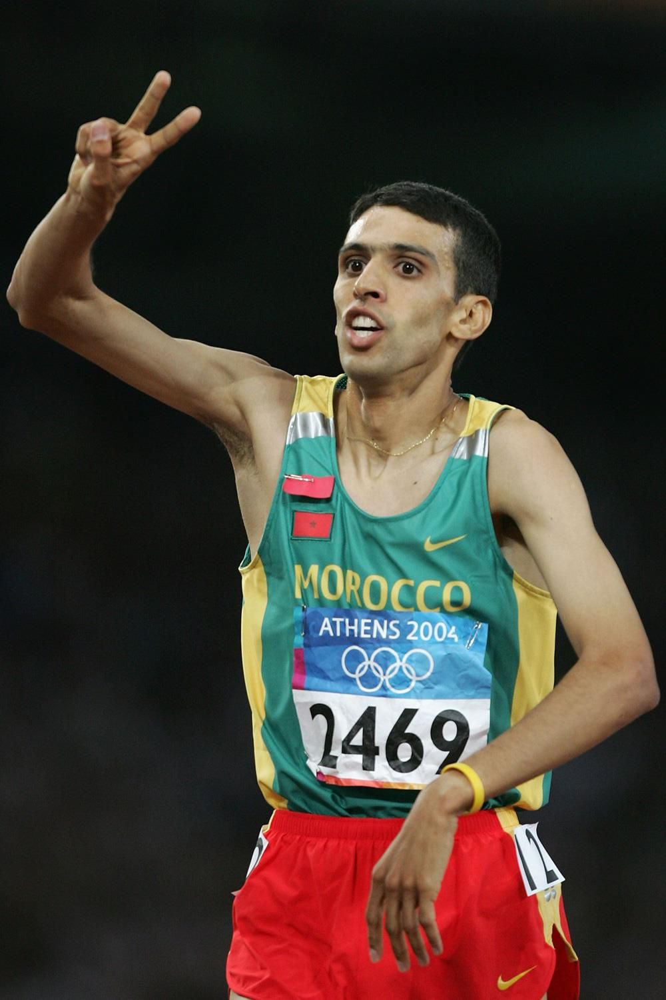

# Hicham El Guerrouj

|          中文名          |                      希查姆·埃尔·奎罗伊                      |
| :----------------------: | :----------------------------------------------------------: |
|       **代表国家**       |                          **摩洛哥**                          |
|      **出生年月日**      |                        **1974.09.14**                        |
|       **主要项目**       |                      **1500米、5000米**                      |
| **国际田联的运动员主页** | **[Hicham El Guerrouj \| Profile \| World Athletics](https://worldathletics.org/athletes/morocco/hicham-el-guerrouj-14212038)** |

**奥运会🥇 x2**

**世锦赛🥇 x4**

**奥运会🥈 x1**

**世锦赛🥈 x2**

**生涯 世界纪录 & 世界最好成绩 x5**

# [个人最佳](./Personal-Best.md) | [荣誉列举](./Honors.md) | [成绩汇总](./Results.md) | [常用统计](./Stats.md)

# [首页](../../../../README.md)