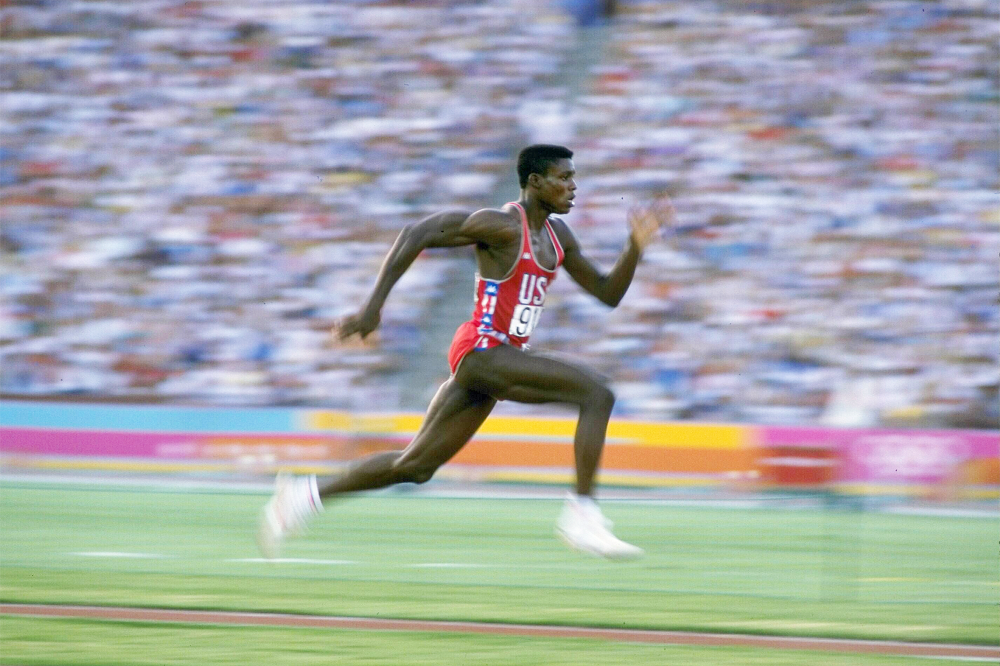

# Carl Lewis

|          中文名          |                         卡尔·刘易斯                          |
| :----------------------: | :----------------------------------------------------------: |
|       **代表国家**       |                           **美国**                           |
|      **出生年月日**      |                        **1961.07.01**                        |
| **世界田联的运动员主页** | **[Carl Lewis \| Profile \| World Athletics](https://worldathletics.org/athletes/united-states/carl-lewis-14244008)** |

**奥运会🥇 x9**

**世锦赛🥇 x8**

**奥运会🥈 x1**

**世锦赛🥈 x1**

**世界纪录 & 世界最好成绩 次数 x16**

> ⚠前排提醒最好使用电脑端观看，如果使用手机观看，请使用浏览器的电脑模式/桌面模式

# [个人最佳](./Personal-Best.md) | [荣誉列举](./Honors.md) | [成绩汇总](./Results.md) | [常用统计](./Stats.md)

# [首页◀](../../../../README.md)
