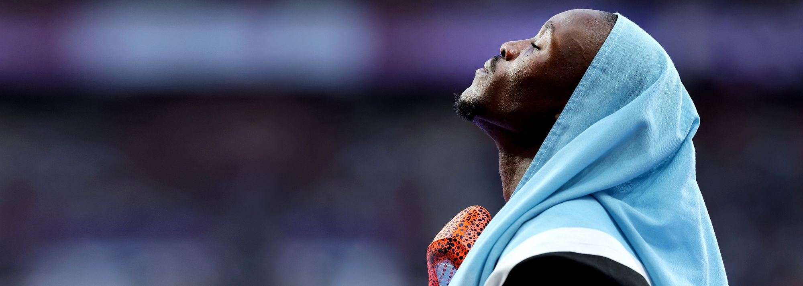

# Letsile Tebogo

|           姓名           |                        莱斯利·特博格                         |
| :----------------------: | :----------------------------------------------------------: |
|       **代表国家**       |                         **博茨瓦纳**                         |
|      **出生年月日**      |                        **2003.06.07**                        |
|      **运动员代码**      |                         **14883897**                         |
| **世界田联的运动员主页** | **[Letsile Tebogo \| Profile \| World Athletics](https://worldathletics.org/athletes/botswana/letsile-tebogo-14883897)** |
|       **社交账号**       | **[Instagram](https://www.instagram.com/tebogo_letsile_/) \| [X](https://x.com/tebogo_letsile_)** |

**奥运会🥇 x1**

**奥运会🥈 x1**

**世锦赛🥈 x1**

**世锦赛🥉 x1**

> ⚠前排提醒最好使用电脑端观看，如果使用手机观看，请使用浏览器的电脑模式/桌面模式

# [个人最佳](./Personal-Best.md) \| [荣誉列举](./Honors.md) \| [成绩汇总](./Results.md) \| [常用统计](./Stats.md)
