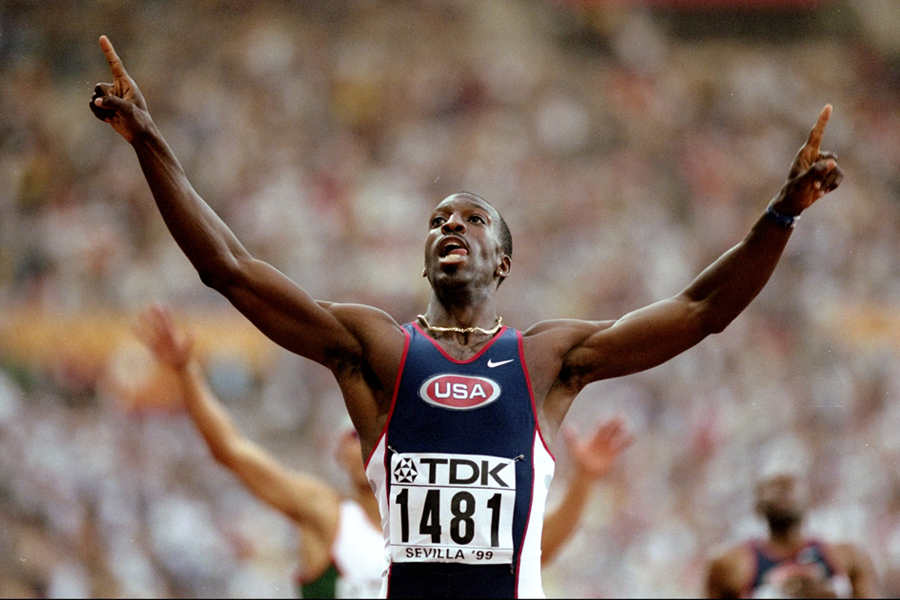

# Michael Johnson

|          中文名          |                        迈克尔·约翰逊                         |
| :----------------------: | :----------------------------------------------------------: |
|       **代表国家**       |                           **美国**                           |
|      **出生年月日**      |                        **1967.09.13**                        |
| **世界田联的运动员主页** | **[Michael Johnson \| Profile \| World Athletics](https://worldathletics.org/athletes/united-states/michael-johnson-14242187)** |

**奥运会🥇 x4**

**世锦赛🥇 x8**

**世界纪录 & 世界最好成绩 x8**

**大奖赛总决赛🥇 x3**

**黄金联赛胜场 x9**

# [个人最佳](./Personal-Best.md) | [荣誉列举](./Honors.md) | [成绩汇总](./Results.md) | [常用统计](./Stats.md)

# [首页◀](../../../../README.md)