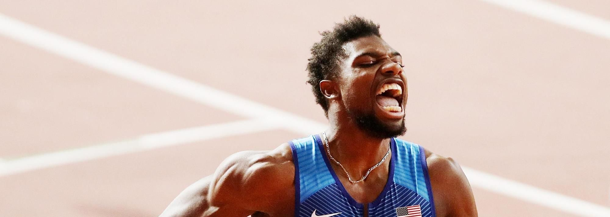

# Noah Lyles

## 基本信息

|           姓名           |                   诺亚·莱尔斯(Noah Lyles)                    |
| :----------------------: | :----------------------------------------------------------: |
|       **代表国家**       |                   **美国(United States)**                    |
|      **出生年月日**      |                        **1997.07.18**                        |
|      **运动员代码**      |                         **14536762**                         |
| **世界田联的运动员主页** | [Noah Lyles \| Profile \| World Athletics](https://worldathletics.org/athletes/united-states/noah-lyles-14536762) |

## 个人最佳

|    项目     |      成绩       |    创造日期    |        比赛或地点        |       标注        |   得分   |
| :---------: | :-------------: | :------------: | :----------------------: | :---------------: | :------: |
|   55米(i)   |      6.24       |   2016.02.27   |     弗吉尼亚州汉普顿     |         -         |   1115   |
|   60米(i)   |      6.43A      |   2024.02.17   |    美国室内锦标赛决赛    |       前WB        |   1250   |
|  **100米**  | **9.79(+1.0)**  | **2024.08.04** |    **巴黎奥运会决赛**    |  **历史第12人**   | **1280** |
| *150米直道  |   14.41(+0.3)   |   2024.05.19   |      亚特兰大城市赛      |        *NR        |    -     |
|  **200米**  | **19.31(+0.4)** | **2022.07.21** |   **俄勒冈世锦赛决赛**   | **NR，历史第3人** | **1331** |
|  200米(i)   |      20.63      |   2016.03.13   |     纽约新百伦国民赛     |         -         |   1190   |
|  300米(i)   |     31.87A      |   2017.03.04   |    美国室内锦标赛决赛    |       前WB        |   1231   |
|  **400米**  |    **47.04**    | **2016.04.23** |   **马里兰州森林维尔**   |       **-**       | **1042** |
| **4x100米** |    **37.10**    | **2019.10.05** |    **多哈世锦赛决赛**    |      **NR**       | **1297** |
|   4x200米   |     1:19.88     |   2017.04.23   |    拿骚世界接力赛决赛    |         -         |   1223   |
| 4x200米(i)  |     1:26.21     |   2016.03.13   |     纽约新百伦国民赛     |         -         |   1041   |
| **4x400米** |   **3:02.99**   | **2023.04.01** |    **佛罗里达接力赛**    |       **-**       | **1151** |
| 4x400米(i)  |     3:02.60     |   2024.03.03   |    格拉斯哥室内世锦赛    |         -         |   1211   |
|  **跳高**   |    **2.03**     | **2015.03.31** | **弗吉尼亚州布莱克斯堡** |       **-**       | **940**  |

- <b>*表示不收录的成绩，(i)表示室内</b>

- **如果不知道比赛名，只会标上比赛地点**

- **世锦赛、奥运会项目全部加粗**

## 荣誉列举

- **奥运 :1st_place_medal: x1**

- **世锦赛 :1st_place_medal: x6**

- **世锦赛 :2nd_place_medal: x1**

- **奥运 :3rd_place_medal: x2**

- **钻石联赛总决赛冠军 :diamond_shape_with_a_dot_inside: x5**

- **钻石联赛胜场数x22**

- **全国冠军x8**

- **室内世锦赛 :2nd_place_medal: x2**

### 奥运会

|      年份      |   项目    |         名次          |      成绩      |
| :------------: | :-------: | :-------------------: | :------------: |
|   2021，东京   |   200米   |   :3rd_place_medal:   |  19.74(-0.5)   |
| **2024，巴黎** | **100米** | **:1st_place_medal:** | **9.79(+1.0)** |
|   2024，巴黎   |   200米   |   :3rd_place_medal:   |  19.70(+0.4)   |

### 世锦赛

|        年份        |    项目     |         名次          |      成绩       |
| :----------------: | :---------: | :-------------------: | :-------------: |
|   **2019，多哈**   |  **200米**  | **:1st_place_medal:** | **19.83(+0.3)** |
|   **2019，多哈**   | **4x100米** | **:1st_place_medal:** |    **37.10**    |
|  **2022，俄勒冈**  |  **200米**  | **:1st_place_medal:** | **19.31(+0.4)** |
|    2022，俄勒冈    |   4x100米   |   :2nd_place_medal:   |      37.55      |
| **2023，布达佩斯** |  **100米**  | **:1st_place_medal:** |   **9.83(0)**   |
| **2023.布达佩斯**  |  **200米**  | **:1st_place_medal:** | **19.52(-0.2)** |
| **2023，布达佩斯** | **4x100米** | **:1st_place_medal:** |    **37.38**    |

### 钻石联赛冠军

|      日期      |     地点     |   项目    |      成绩       |
| :------------: | :----------: | :-------: | :-------------: |
|   2017.05.13   |     上海     |   200米   |   19.90(-0.4)   |
| **2017.09.01** | **布鲁塞尔** | **200米** | **20.00(+0.9)** |
|   2018.05.04   |     多哈     |   200米   |   19.83(+1.3)   |
|   2018.05.26   |     尤金     |   200米   |   19.69(+2.0)   |
|   2018.07.05   |     洛桑     |   200米   |   19.69(+0.4)   |
|   2018.07.20   |    摩纳哥    |   200米   |   19.65(+0.9)   |
| **2018.08.30** |  **苏黎世**  | **200米** | **19.67(-0.2)** |
|   2019.05.18   |     上海     |   100米   |   9.86(+0.9)    |
|   2019.07.05   |     洛桑     |   200米   |   19.50(-0.1)   |
|   2019.08.24   |     巴黎     |   200米   |   19.65(+0.2)   |
| **2019.08.29** |  **苏黎世**  | **100米** | **9.98(-0.4)**  |
| **2019.09.06** | **布鲁塞尔** | **200米** | **19.74(+0.8)** |
|   2020.08.14   |    摩纳哥    |   200米   |   19.76(+0.7)   |
|   2021.08.21   |     尤金     |   200米   |   19.52(+1.5)   |
|   2022.05.13   |     多哈     |   200米   |  *19.72(+2.1)   |
|   2022.08.10   |    摩纳哥    |   200米   |   19.46(+0.8)   |
|   2022.08.26   |     洛桑     |   200米   |   19.56(+1.3)   |
| **2022.09.08** |  **苏黎世**  | **200米** | **19.52(-0.6)** |
|   2023.06.09   |     巴黎     |   100米   |   9.97(-0.9)    |
|   2023.07.23   |     伦敦     |   200米   |   19.47(+1.6)   |
|   2023.08.31   |    苏黎世    |   200米   |   19.80(-0.5)   |
|   2024.07.20   |     伦敦     |   100米   |   9.81(-0.3)    |

### 全国锦标赛冠军

|       年份       |   项目    |      成绩       |
| :--------------: | :-------: | :-------------: |
| 2017, 阿尔伯克基 |   300米   |     31.87A      |
| **2018, 得梅因** | **100米** | **9.88(+1.1)**  |
| **2019, 得梅因** | **200米** | **19.78(-0.7)** |
|  **2021, 尤金**  | **200米** | **19.74(+0.3)** |
|  **2022, 尤金**  | **200米** | **19.67(-0.3)** |
| 2024, 阿尔伯克基 |   60米    |      6.43       |
|  **2024, 尤金**  | **100米** | **9.83(+0.4)**  |
|  **2024, 尤金**  | **200米** | **19.53(+0.5)** |

### 室内世锦赛

|      年份      |  项目   |       名次        |  成绩   |
| :------------: | :-----: | :---------------: | :-----: |
| 2024, 格拉斯哥 |  60米   | :2nd_place_medal: |  6.44   |
| 2024, 格拉斯哥 | 4x400米 | :2nd_place_medal: | 3:02.60 |

## 成绩汇总

### 2024

|                    日期                     |    项目    |        比赛及其阶段        |             赛事等级              |                 成绩                  |                名次                |               标注               |
| :-----------------------------------------: | :--------: | :------------------------: | :-------------------------------: | :-----------------------------------: | :--------------------------------: | :------------------------------: |
| 2024.01.28 |  60米(i)   |  佛罗里达大学邀请赛, 预赛  |                 -                 | 6.70 | 1 | 未收录 |
| 2024.01.28 |  60米(i)   |  佛罗里达大学邀请赛, 决赛  |                 -                 | 6.63 | 1 | 未收录 |
|                 2024.02.04                  |  60米(i)   |   新百伦室内大奖赛, 预赛   |                 A                 |                 6.54                  |                 1                  |                SB                |
|                 2024.02.04                  |  60米(i)   |   新百伦室内大奖赛, 决赛   |                 A                 |                 6.44                  |                 1                  |                PB                |
|                 2024.02.17                  |  60米(i)   |    美国室内锦标赛, 预赛    |                 B                 |                 6.52A                 |                 1                  |                -                 |
|                 2024.02.17                  |  60米(i)   |    美国室内锦标赛, 决赛    |                 B                 |                 6.43A                 |                 1                  |                PB                |
|                 2024.03.01                  |  60米(i)   |  格拉斯哥室内世锦赛, 预赛  |                GW                 |                 6.57                  |                 1                  |                -                 |
|                 2024.03.01                  |  60米(i)   | 格拉斯哥室内世锦赛, 半决赛 |                GW                 |                 6.47                  |                 1                  |                -                 |
|                 2024.03.01                  |  60米(i)   |  格拉斯哥室内世锦赛, 决赛  |                GW                 |                 6.44                  |                 2                  |                -                 |
|                 2024.03.03                  | 4x400米(i) |  格拉斯哥室内世锦赛, 决赛  |                GW                 |                3:02.60                |                 2                  |                -                 |
|                 2024.03.30                  |  4x100米   |       佛罗里达接力赛       |                 E                 |                  DNF                  |                 -                  |                -                 |
|                 2024.04.13                  |  4x100米   |       汤姆琼斯纪念赛       |                 E                 |                  DQ                   |                 -                  |                -                 |
|                 2024.04.13                  |   100米    |   汤姆琼斯纪念赛, 第1组    |                 E                 |              10.01(+1.7)              |                 1                  |                SB                |
|                 2024.04.28                  |   100米    |        百慕大大奖赛        |                 B                 |              *9.96(+3.0)              |                 1                  |                -                 |
|                 2024.05.04                  |  4x100米   |   巴哈马世界接力赛, 预赛   |                 -                 |                 37.49                 |                 1                  |                WL                |
|                 2024.05.05                  |  4x100米   |   巴哈马世界接力赛, 决赛   |                 -                 |                 37.40                 |                 1                  |                WL                |
| 2024.05.19 | *直道150米 |       亚特兰大城市赛       |                 -                 |             *14.41(+0.3)              | 1 |           *NR, 未收录            |
|                 2024.06.01                  |   100米    |         跑者大奖赛         |                 B                 |              9.85(+0.9)               |                 2                  |                SB                |
|                 2024.06.09                  |   200米    |         纽约大奖赛         |                 A                 |              19.77(-1.6)              |                 1                  |                SB                |
|                 2024.06.22                  |   100米    |   美国奥运会选拔赛, 预赛   |                 B                 |              9.92(+0.3)               |                 1                  |                -                 |
|                 2024.06.23                  |   100米    |  美国奥运会选拔赛, 半决赛  |                 B                 |              *9.80(+3.0)              |                 1                  |                -                 |
|                 2024.06.23                  |   100米    |   美国奥运会选拔赛, 决赛   |                 B                 |              9.83(+0.4)               |                 1                  |               =PB                |
|                 2024.06.27                  |   200米    |   美国奥运会选拔赛, 预赛   |                 B                 |               20.10(0)                |                 1                  |                -                 |
|                 2024.06.28                  |   200米    |  美国奥运会选拔赛, 半决赛  |                 B                 |             *19.60(+2.5)              |                 1                  |                -                 |
|                 2024.06.30                  |   200米    |   美国奥运会选拔赛, 决赛   |                 B                 |              19.53(+0.5)              |                 1                  |                WL                |
|                 2024.07.20                  |   100米    |     :diamond_shape_with_a_dot_inside: 钻石联赛 - 伦敦站     |                GW                 |              9.81(-0.3)               |                 1                  |                PB                |
|                 **2024.08.03**              |  **100米** |      :earth_africa: **巴黎奥运会, 预赛**      |                **OW**             |              **10.04(-0.2)**              |                 **2**              |                **-**             |
|                 **2024.08.04**              |  **100米** |     :earth_africa: **巴黎奥运会, 半决赛**     |                **OW**             |              **9.83(+0.7)**           |                 **2**              |                **-**             |
|                 **2024.08.05**              |  **100米** |      :earth_africa: **巴黎奥运会, 决赛**      | **OW** |              **9.79(+1.0)**           |                 **1**              |                **PB**                |
|                 **2024.08.05**              |  **200米** |      :earth_africa: **巴黎奥运会, 预赛**      | **OW** |              **20.19(+0.1)**              |                 **1**              |                **-**             |
|                 **2024.08.07**              |  **200米** |     :earth_africa: **巴黎奥运会, 半决赛**     | **OW** |              **20.08(-0.2)**              |                 **2**              |                **-**             |
|                 **2024.08.08**              |  **200米** |      :earth_africa: **巴黎奥运会, 决赛**      | **OW** |              **19.70(+0.4)**              |                 **3**              |                **-**             |

### 2023

|    日期    |  项目   |      比赛及其阶段      | 赛事等级 |    成绩     | 名次 | 标注 |
| :--------: | :-----: | :--------------------: | :------: | :---------: | :--: | :--: |
| 2023.02.04 | 60米(i) | 新百伦室内大奖赛, 预赛 |    A     |    6.56     |  1   |  SB  |
| 2023.02.04 | 60米(i) | 新百伦室内大奖赛, 决赛 |    A     |    6.51     |  1   |  PB  |
| 2023.02.11 | 60米(i) |     米尔罗斯运动会     |    A     |     DQ      |  -   |  -   |
| 2023.02.17 | 60米(i) |  美国室内锦标赛, 预赛  |    D     |    6.60     |  1   |  -   |
| 2023.02.18 | 60米(i) | 美国室内锦标赛, 半决赛 |    D     |    6.56     |  1   |      |
| 2023.02.18 | 60米(i) |  美国室内锦标赛, 决赛  |    D     |     DNS     |  -   |  -   |
| 2023.04.01 | 4x400米 |     佛罗里达接力赛     |    F     |   3:02.99   |  1   |  -   |
| 2023.04.14 |  200米  |     汤姆琼斯纪念赛     |    E     | 20.16(-1.2) |  1   |  SB  |
| 2023.04.15 |  100米  |     汤姆琼斯纪念赛     |    E     | 9.95(+1.6)  |  1   |  SB  |
| 2023.04.23 |  100米  | 纯田径春季邀请赛, 预赛 |    F     | *9.90(+4.3) |  1   |  -   |
| 2023.04.23 |  100米  | 纯田径春季邀请赛, 决赛 |    F     | *9.92(+2.6) |  2   |  -   |
| 2023.05.21 |  100米  |      百慕大大奖赛      |    A     | *9.80(+4.4) |  2   |  -   |
| 2023.06.03 |  200米  |       跑者大奖赛       |    B     | 19.67(+0.3) |  1   |  WL  |
| 2023.06.09 |  100米  |   :diamond_shape_with_a_dot_inside: 钻石联赛 - 巴黎站   |    GW    | 9.97(-0.9)  |  1   |  -   |
| 2023.06.24 |  200米  |       纽约大奖赛       |    A     | 19.83(+0.8) |  1   |  -   |
| 2023.07.06 |  100米  |  美国田径锦标赛, 预赛  |    B     | 10.05(+0.6) |  2   |  -   |
| 2023.07.07 |  100米  | 美国田径锦标赛, 半决赛 |    B     | 9.94(+1.2)  |  1   |  SB  |
| 2023.07.07 |  100米  |  美国田径锦标赛, 决赛  |    B     | 10.00(+0.1) |  3   |  -   |
| 2023.07.23 |  200米  |   :diamond_shape_with_a_dot_inside: 钻石联赛 - 伦敦站   |    GW    | 19.47(+1.6) |  1   |  WL  |
| **2023.08.19** | **100米** | :earth_africa: **布达佩斯世锦赛, 预赛** | **OW** | **9.95(-0.6)** | **1** | **-**    |
| **2023.08.20** | **100米** | :earth_africa: **布达佩斯世锦赛, 半决赛** | **OW** | **9.87(+0.3)** | **1** | **SB**   |
| **2023.08.20** | **100米** | :earth_africa: **布达佩斯世锦赛, 决赛** | **OW** | **9.83(0)** | **1** | **PB, =WL** |
| **2023.08.23** | **200米** | :earth_africa: **布达佩斯世锦赛, 预赛** | **OW** | **20.10(-0.1)** | **1** | **-** |
| **2023.08.24** | **200米** | :earth_africa: **布达佩斯世锦赛, 半决赛** | **OW** | **19.76(-0.1)** | **1** | **-** |
| **2023.08.25** | **200米** | :earth_africa: **布达佩斯世锦赛, 决赛** | **OW** | **19.52(-0.1)** | **1** | **-** |
| **2023.08.26** | **4x100米** | :earth_africa: **布达佩斯世锦赛, 决赛** | **OW** | **37.38**   | **1** | **WL**   |
| 2023.08.31 | 200米   | :diamond_shape_with_a_dot_inside: 钻石联赛 - 苏黎世站 | GW | 19.80(-0.5) | 1 | -        |
| 2023.09.16 | 100米   | :diamond_shape_with_a_dot_inside: 普雷方丹经典赛 | DF | 9.85(+0.1)  | 2 | -        |

