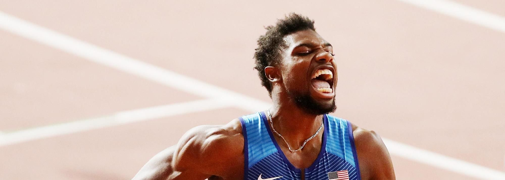

# Noah Lyles

|                中文名                |                         诺亚·莱尔斯                          |
| :----------------------------------: | :----------------------------------------------------------: |
|             **代表国家**             |                           **美国**                           |
|            **出生年月日**            |                        **1997.07.18**                        |
|            **运动员代码**            |                         **14536762**                         |
|       **世界田联的运动员主页**       | **[Noah Lyles \| Profile \| World Athletics](https://worldathletics.org/athletes/united-states/noah-lyles-14536762)** |
|             **社交账号（需要特殊手段）**             | **[Instagram](https://www.instagram.com/nojo18/feed/) \| [X](https://x.com/lylesnoah)** |

- **奥运 🥇 x1**

- **世锦赛 :1st_place_medal: x6**

- **世锦赛 :2nd_place_medal: x1**

- **奥运 :3rd_place_medal: x2**

# [个人最佳]() \| [荣誉列举]() \| [成绩汇总]() \| [常用统计]()
