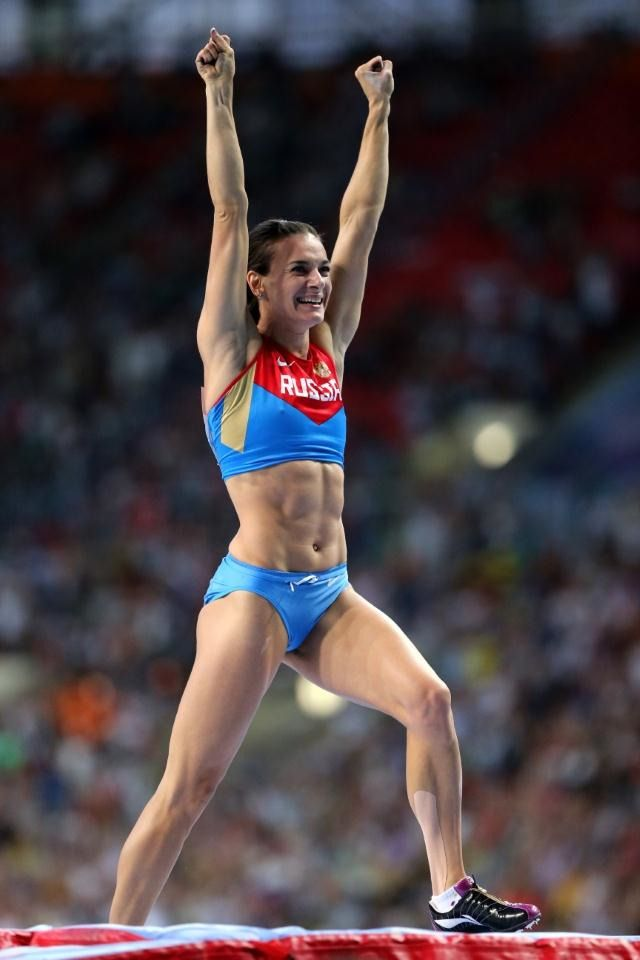

# Yelena Isinbayeva

|          中文名          |                      叶莲娜·伊辛巴耶娃                       |
| :----------------------: | :----------------------------------------------------------: |
|       **代表国家**       |                          **俄罗斯**                          |
|      **出生年月日**      |                        **1982.06.03**                        |
|       **主要项目**       |                         **撑竿跳高**                         |
| **世界田联的运动员主页** | **[Yelena Isinbayava \| Profile \| World Athletics](https://worldathletics.org/athletes/_/14297931)** |

**奥运会🥇 x2**

**世锦赛🥇 x3**

**奥运会🥉 x1**

**世锦赛🥉 x1**

**世界纪录 & 世界最好成绩 x28**

# [荣誉列举](./Honors.md) | [成绩汇总](./Results.md)

> 因项目特殊，只列举这两项

# [首页◀](../../../../README.md)