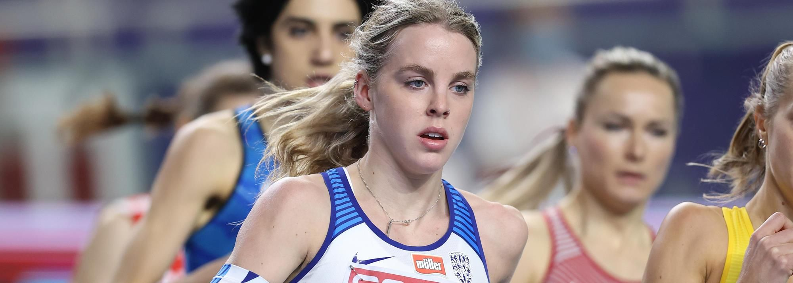

# Keely Hodgkinson

|          中文名          |                        基利·霍奇金森                         |
| :----------------------: | :----------------------------------------------------------: |
|       **代表国家**       |                           **英国**                           |
|      **出生年月日**      |                        **2002.03.03**                        |
|       **主要项目**       |                          **800米**                           |
| **世界田联的运动员主页** | **[Keely Hodgkinson \| Profile \| World Athletics](https://worldathletics.org/athletes/great-britain-ni/keely-hodgkinson-14642894)** |

**奥运会🥇 x1**

**奥运会🥈 x1**

**世锦赛🥈 x2**

**钻石联赛总决赛冠军💎 x1**

**生涯 世界纪录 & 世界最好成绩 x1**

# [个人最佳](./Personal-Best.md) | [荣誉列举](./Honors.md) | [成绩汇总](./Results.md) | [常用统计](./Stats.md)

# [首页◀](../../../../README.md)