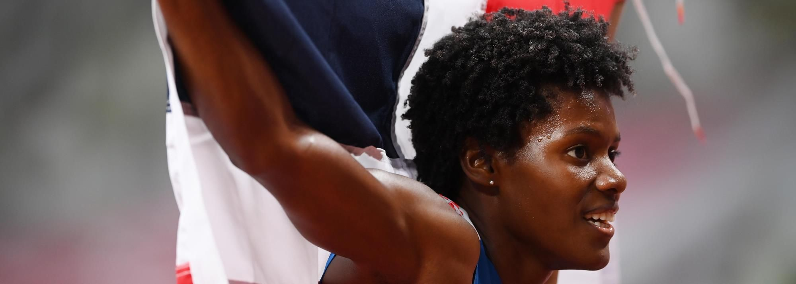

# Marileidy Paulino

|          中文名          |                       玛丽莱迪·保利诺                        |
| :----------------------: | :----------------------------------------------------------: |
|       **代表国家**       |                      **多米尼加共和国**                      |
|      **出生年月日**      |                        **1996.10.25**                        |
|       **主要项目**       |                          **400米**                           |
| **世界田联的运动员主页** | **[Marileidy Paulino \| Profile \| World Athletics](https://worldathletics.org/athletes/dominican-republic/marileidy-paulino-14749613)** |

**奥运会🥇 x1**

**世锦赛🥇 x2**

**奥运会🥈 x2**

**钻石联赛总决赛冠军💎 x3**

# [个人最佳](./Personal-Best.md) | [荣誉列举](./Honors.md) | [成绩汇总](./Results.md) | [常用统计](./Stats.md)

# [首页◀](../../../../README.md)