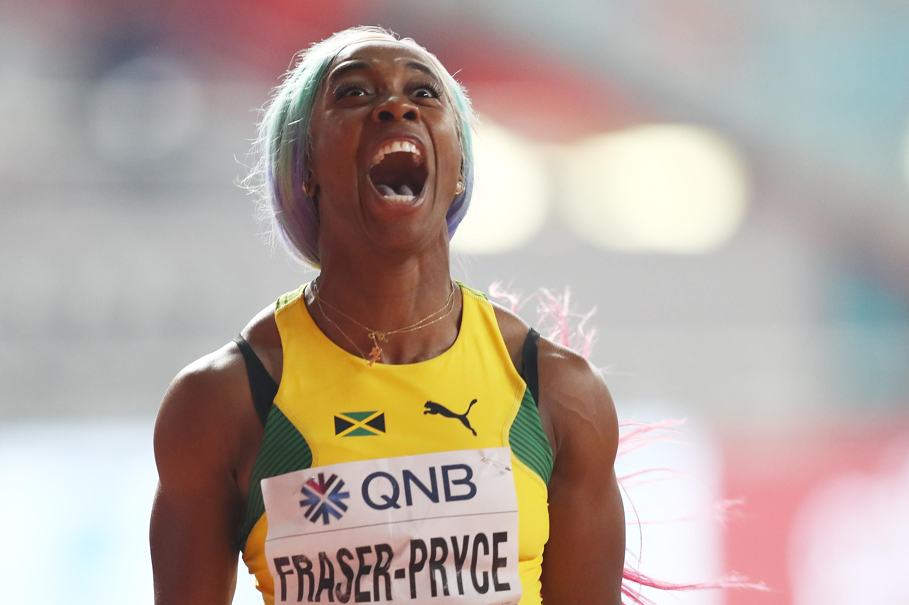

# Shelly-Ann Fraser-Pryce

|          中文名          |                    雪莉-安·弗雷泽-普莱斯                     |
| :----------------------: | :----------------------------------------------------------: |
|       **代表国家**       |                          **牙买加**                          |
|      **出生年月日**      |                        **1986.12.27**                        |
|       **主要项目**       |                       **100米、200米**                       |
| **世界田联的运动员主页** | **[Shelly-Ann Fraser-Pryce \| Profile \| World Athletics](https://worldathletics.org/athletes/jamaica/shelly-ann-fraser-pryce-14285680)** |

**奥运会🥇 x3**

**世锦赛🥇 x10**

**奥运会🥈 x4**

**世锦赛🥈 x5**

# [个人最佳](./Personal-Best.md) \| [荣誉列举](./Honors.md) \| [成绩汇总](./Results.md) | [厚度统计](./Stats.md)

# [首页](../../../../README.md)