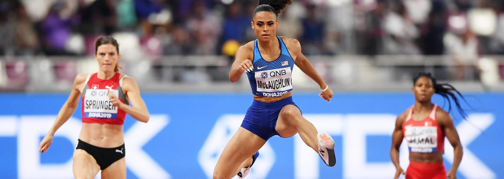

# Sydney Mclaughlin-Levrone

|          中文名          |                    悉尼·麦克劳克林-莱福隆                    |
| :----------------------: | :----------------------------------------------------------: |
|       **代表国家**       |                           **美国**                           |
|      **出生年月日**      |                        **1999.08.07**                        |
| **世界田联的运动员主页** | **[Sydney Mclaughlin-Levrone\| Profile \| World Athletics](https://worldathletics.org/athletes/united-states/sydney-mclaughlin-levrone-14624749)** |

**奥运会🥇 x4**

**世锦赛🥇 x3**

**世锦赛🥈 x1**

**钻石联赛总决赛冠军💎 x1**

> ⚠前排提醒最好使用电脑端观看，如果使用手机观看，请使用浏览器的电脑模式/桌面模式

# [个人最佳](./Personal-Best.md) \| [荣誉列举](./Honors.md) \| [成绩汇总](./Results.md) | [常用统计](./Stats.md)

# [首页◀](../../../../README.md)