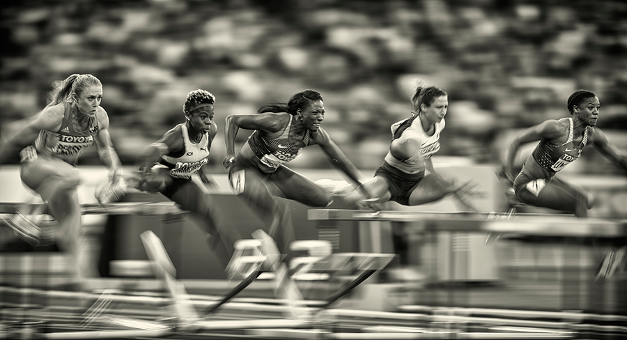
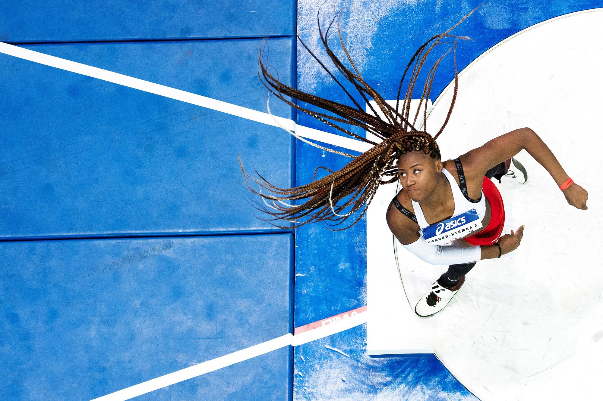
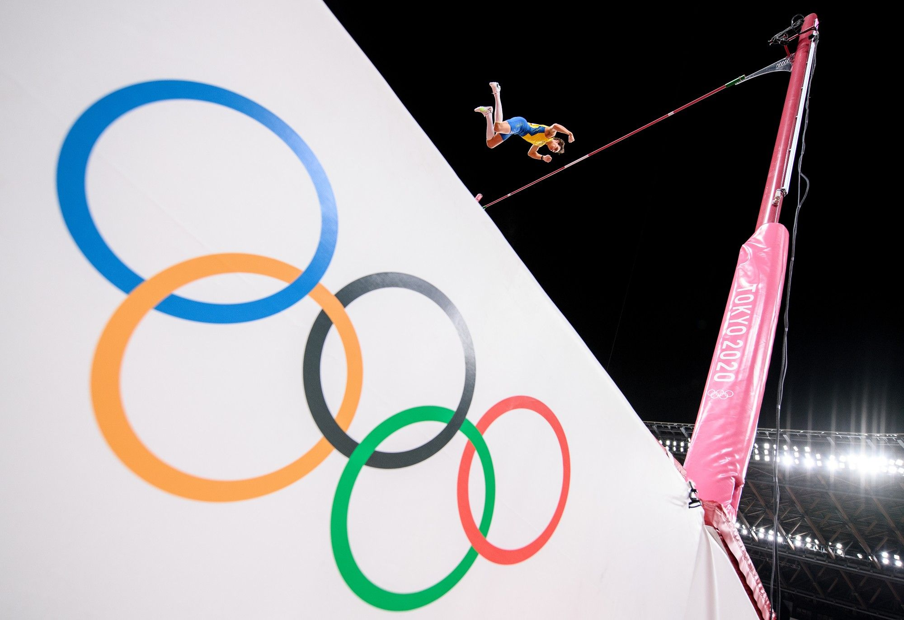

# 国际田联年度摄影作品

从2017年开始，每一年首先接收来自各地的摄影，然后决定出1份包括3个作品的决赛名单，最终从这3个作品中评审出年度摄影作品。

这里给出每年的决赛名单。

## 年份选择

- [2017](#1)
- [2018](#2)
- [2019](#3)
- [2020](#4)
- [2021](#5)
- [2022](#6)
- [2023](#7)
- [2024](#8)

|  2017年   |
| :-----------------------: |
|  |
|  |
|  |

|   2018年    |
| :-----------------------: |
|  |
|  |
|  |
|  |

|   2019年    |
| :-----------------------: |
|  |
|  |
|  |

|   2020年    |
| :-----------------------: |
|  |
|  |
|  |

|   2021年    |
| :-----------------------: |
|  |
|  |
|  |

|   2022年    |
| :-----------------------: |
|  |
|  |
|  |

|   2023年    |
| :-----------------------: |
|  |
|  |
|  |

|   2024年    |
| :-----------------------: |
|  |
|  |
|  |

