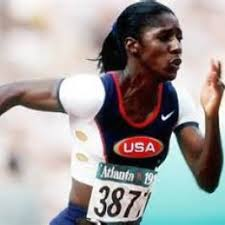
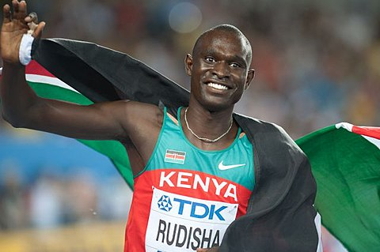
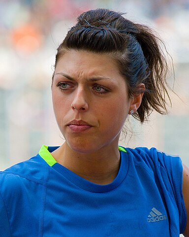

# 历年国际田联评选的年度最佳运动员

**[简约版](./List-simple.md)**

田联从1988年开始评选，每年一次，每次评选出一男一女。2023年开始，每次评选分成径赛、田赛、场外三个领域，每个领域各自评选出一男一女作为该领域的年度最佳运动员，每年将评出6位。

## [首页◀](../../README.md)

## 1988

|          |              男               |                     女                      |
| :------: | :---------------------------: | :-----------------------------------------: |
|  选手名  |          卡尔·刘易斯          |          弗洛伦斯·格里菲斯·乔伊纳           |
| 代表国家 |             美国              |                    美国                     |
| 主要项目 |      跳远、100米、200米       |                100米、200米                 |
| 大赛荣誉 | 奥运会9金1银，世锦赛8金1银1铜 |         奥运会3金2银，世锦赛1金1银          |
| 维基图片 |  |  |

## 1989

|          |                男                |                  女                   |
| :------: | :------------------------------: | :-----------------------------------: |
|  选手名  |           罗杰·金多姆            |          安娜·菲德利亚·奎罗           |
| 代表国家 |               美国               |                 古巴                  |
| 主要项目 |             110米栏              |             400米、800米              |
| 大赛荣誉 |       奥运会2金，世锦赛1铜       |      奥运会1银1铜，世锦赛2金1银       |
| 维基图片 |  |  |

## 1990

|          |                男                |                女                |
| :------: | :------------------------------: | :------------------------------: |
|  选手名  |          史蒂夫·巴克利           |            梅琳·奥蒂             |
| 代表国家 |               英国               |              牙买加              |
| 主要项目 |               标枪               |           100米、200米           |
| 大赛荣誉 |     奥运会2银1铜，世锦赛2银      |  奥运会3银6铜，世锦赛3金4银7铜   |
| 维基图片 |  |  |

## 1991

|          |              男               |                女                |
| :------: | :---------------------------: | :------------------------------: |
|  选手名  |          卡尔·刘易斯          |          卡特林·克拉布           |
| 代表国家 |             美国              |               德国               |
| 主要项目 |          跳远、100米          |           100米、200米           |
| 大赛荣誉 | 奥运会9金1银，世锦赛8金1银1铜 |           世锦赛2金2铜           |
| 维基图片 |  |  |

## 1992

|          |               男               |               女                |
| :------: | :----------------------------: | :-----------------------------: |
|  选手名  |            凯文·扬             |           海克·亨克尔           |
| 代表国家 |              美国              |              德国               |
| 主要项目 |            400米栏             |              跳高               |
| 大赛荣誉 |      奥运会1金，世锦赛1金      |      奥运会1金，世锦赛1金       |
| 维基图片 |  |  |

## 1993

|          |                男                |                女                |
| :------: | :------------------------------: | :------------------------------: |
|  选手名  |           科林·杰克逊            |           莎莉·冈内尔            |
| 代表国家 |               英国               |               英国               |
| 主要项目 |             110米栏              |             400米栏              |
| 大赛荣誉 |    奥运会1银，世锦赛2金2银1铜    |  奥运会1金1铜，世锦赛1金1银1铜   |
| 维基图片 |  |  |

## 1994

|          |                  男                   |                   女                    |
| :------: | :-----------------------------------: | :-------------------------------------: |
|  选手名  |             诺尔丁·莫塞利             |            杰基·乔伊纳-柯西             |
| 代表国家 |              阿尔及利亚               |                  美国                   |
| 主要项目 |                1500米                 |             七项全能、跳远              |
| 大赛荣誉 |         奥运会1金，世锦赛3金          |       奥运会3金1银2铜，世锦赛4金        |
| 维基图片 |  |  |

## 1995

|          |                 男                  |                女                |
| :------: | :---------------------------------: | :------------------------------: |
|  选手名  |           乔纳森·爱德华兹           |           格温·托伦斯            |
| 代表国家 |                英国                 |               美国               |
| 主要项目 |              三级跳远               |           100米、200米           |
| 大赛荣誉 |    奥运会1金1银，世锦赛2金1银2铜    | 奥运会3金1银1铜，世锦赛3金4银1铜 |
| 维基图片 |  |  |

## 1996

|          |                 男                 |                   女                   |
| :------: | :--------------------------------: | :------------------------------------: |
|  选手名  |           迈克尔·约翰逊            |         斯维特拉娜·马斯特科娃          |
| 代表国家 |                美国                |                 俄罗斯                 |
| 主要项目 |            200米、400米            |             800米、1500米              |
| 大赛荣誉 |        奥运会4金，世锦赛8金        |        奥运会2金，世锦赛1金1铜         |
| 维基图片 |  |  |

## 1997

|          |                 男                 |               女                |
| :------: | :--------------------------------: | :-----------------------------: |
|  选手名  |          威尔逊·基普凯特           |           马里昂·琼斯           |
| 代表国家 |                丹麦                |              美国               |
| 主要项目 |               800米                |          100米、200米           |
| 大赛荣誉 |      奥运会1银1铜，世锦赛3金       |   奥运会1金1铜，世锦赛3金1铜    |
| 维基图片 |  |  |

## 1998

|          |                  男                   |               女                |
| :------: | :-----------------------------------: | :-----------------------------: |
|  选手名  |          海尔·格布雷西拉西耶          |           马里昂·琼斯           |
| 代表国家 |              埃塞俄比亚               |              美国               |
| 主要项目 |            5000米、10000米            |          100米、200米           |
| 大赛荣誉 | 奥运会2金，世锦赛4金2银1铜，大满贯4金 |   奥运会1金1铜，世锦赛3金1铜    |
| 维基图片 |  |  |

## 1999

|          |                 男                 |                              女                              |
| :------: | :--------------------------------: | :----------------------------------------------------------: |
|  选手名  |           迈克尔·约翰逊            |                       加布里埃拉·萨博                        |
| 代表国家 |                美国                |                           罗马尼亚                           |
| 主要项目 |               400米                |                        1500米、5000米                        |
| 大赛荣誉 |        奥运会4金，世锦赛8金        |                  奥运会1金1银1铜，世锦赛3金                  |
| 维基图片 |  |  |

## 2000

|          |               男               |               女                |
| :------: | :----------------------------: | :-----------------------------: |
|  选手名  |          扬·泽莱兹尼           |         ~~马里昂·琼斯~~         |
| 代表国家 |              捷克              |            ~~美国~~             |
| 主要项目 |              标枪              |        ~~100米、200米~~         |
| 大赛荣誉 |   奥运会3金1银，世锦赛3金2铜   | ~~奥运会1金1铜，世锦赛3金1铜~~  |
| 维基图片 |  |  |

## 2001

|          |                  男                   |                女                |
| :------: | :-----------------------------------: | :------------------------------: |
|  选手名  |          希查姆·埃尔·奎罗伊           |         斯泰西·德拉吉拉          |
| 代表国家 |                摩洛哥                 |               美国               |
| 主要项目 |                1500米                 |             撑竿跳高             |
| 大赛荣誉 |      奥运会2金1银，世锦赛4金2银       |       奥运会1金，世锦赛2金       |
| 维基图片 |  |  |

## 2002

|          |                  男                   |                 女                 |
| :------: | :-----------------------------------: | :--------------------------------: |
|  选手名  |          希查姆·埃尔·奎罗伊           |          宝拉·拉德克利夫           |
| 代表国家 |                摩洛哥                 |                英国                |
| 主要项目 |                1500米                 |               马拉松               |
| 大赛荣誉 |      奥运会2金1银，世锦赛4金2银       |             大满贯7金              |
| 维基图片 |  |  |

## 2003

|          |                  男                   |                女                 |
| :------: | :-----------------------------------: | :-------------------------------: |
|  选手名  |          希查姆·埃尔·奎罗伊           |          赫斯特里·克洛特          |
| 代表国家 |                摩洛哥                 |               南非                |
| 主要项目 |                1500米                 |               跳高                |
| 大赛荣誉 |      奥运会2金1银，世锦赛4金2银       |       奥运会2银，世锦赛2金        |
| 维基图片 |  |  |

## 2004

|          |                  男                   |                  女                  |
| :------: | :-----------------------------------: | :----------------------------------: |
|  选手名  |             肯尼萨·贝克勒             |          叶莲娜·伊辛巴耶娃           |
| 代表国家 |                摩洛哥                 |                俄罗斯                |
| 主要项目 |            5000米、10000米            |               撑竿跳高               |
| 大赛荣誉 | 奥运会3金1银，世锦赛5金1铜，大满贯2金 |      奥运会2金1铜，世锦赛3金1铜      |
| 维基图片 |     |  |

## 2005

|          |                  男                   |                  女                  |
| :------: | :-----------------------------------: | :----------------------------------: |
|  选手名  |             肯尼萨·贝克勒             |          叶莲娜·伊辛巴耶娃           |
| 代表国家 |                摩洛哥                 |                俄罗斯                |
| 主要项目 |            5000米、10000米            |               撑竿跳高               |
| 大赛荣誉 | 奥运会3金1银，世锦赛5金1铜，大满贯2金 |      奥运会2金1铜，世锦赛3金1铜      |
| 维基图片 |     |  |

## 2006

|          |               男                |                女                 |
| :------: | :-----------------------------: | :-------------------------------: |
|  选手名  |          阿萨法·鲍威尔          |            桑娅·理查兹            |
| 代表国家 |             牙买加              |               美国                |
| 主要项目 |              100米              |               400米               |
| 大赛荣誉 |   奥运会1金，世锦赛2金1银2铜    |    奥运会4金1铜，世锦赛5金2银     |
| 维基图片 |  |  |

## 2007

|          |              男              |                女                |
| :------: | :--------------------------: | :------------------------------: |
|  选手名  |          泰森·盖伊           |         梅塞蕾特·德法尔          |
| 代表国家 |             美国             |            埃塞俄比亚            |
| 主要项目 |         100米、200米         |              5000米              |
| 大赛荣誉 |         世锦赛3金1银         |  奥运会2金1银，世锦赛2金1银2铜   |
| 维基图片 |  |  |

## 2008

|          |              男               |                  女                  |
| :------: | :---------------------------: | :----------------------------------: |
|  选手名  |         尤塞恩·博尔特         |          叶莲娜·伊辛巴耶娃           |
| 代表国家 |            牙买加             |                俄罗斯                |
| 主要项目 |         100米、200米          |               撑竿跳高               |
| 大赛荣誉 |  奥运会8金，世锦赛11金2银1铜  |      奥运会2金1铜，世锦赛3金1铜      |
| 维基图片 |  |  |

## 2009

|          |              男               |                女                 |
| :------: | :---------------------------: | :-------------------------------: |
|  选手名  |         尤塞恩·博尔特         |            桑娅·理查兹            |
| 代表国家 |            牙买加             |               美国                |
| 主要项目 |         100米、200米          |               400米               |
| 大赛荣誉 |  奥运会8金，世锦赛11金2银1铜  |    奥运会4金1铜，世锦赛5金2银     |
| 维基图片 |  |  |

## 2010

|          |                男                |                女                |
| :------: | :------------------------------: | :------------------------------: |
|  选手名  |           大卫·鲁迪沙            |         布兰卡·弗拉希奇          |
| 代表国家 |              肯尼亚              |             克罗地亚             |
| 主要项目 |              800米               |               跳高               |
| 大赛荣誉 |       奥运会2金，世锦赛2金       |    奥运会1银1铜，世锦赛2金2银    |
| 维基图片 |  |  |

## 2011

|          |              男               |                女                |
| :------: | :---------------------------: | :------------------------------: |
|  选手名  |         尤塞恩·博尔特         |           莎莉·皮尔森            |
| 代表国家 |            牙买加             |             澳大利亚             |
| 主要项目 |         100米、200米          |             100米栏              |
| 大赛荣誉 |  奥运会8金，世锦赛11金2银1铜  |    奥运会1金1银，世锦赛2金1银    |
| 维基图片 |  |  |

## 2012

|          |              男               |                女                 |
| :------: | :---------------------------: | :-------------------------------: |
|  选手名  |         尤塞恩·博尔特         |          埃利森·菲利克斯          |
| 代表国家 |            牙买加             |               美国                |
| 主要项目 |         100米、200米          |           200米、400米            |
| 大赛荣誉 |  奥运会8金，世锦赛11金2银1铜  | 奥运会7金3银1铜，世锦赛14金3银3铜 |
| 维基图片 |  |   |

## 2013

|          |              男               |                     女                     |
| :------: | :---------------------------: | :----------------------------------------: |
|  选手名  |         尤塞恩·博尔特         |           雪莉·安·弗雷泽-普莱斯            |
| 代表国家 |            牙买加             |                   牙买加                   |
| 主要项目 |         100米、200米          |                100米、200米                |
| 大赛荣誉 |  奥运会8金，世锦赛11金2银1铜  |     奥运会3金4银1铜，世锦赛10金5银1铜      |
| 维基图片 |  |  |

## 2014

|          |                  男                  |                女                |
| :------: | :----------------------------------: | :------------------------------: |
|  选手名  |            雷诺·拉维莱涅             |          瓦莱丽•亚当斯           |
| 代表国家 |                 法国                 |              新西兰              |
| 主要项目 |               撑竿跳高               |               铅球               |
| 大赛荣誉 |      奥运会1金1银，世锦赛1银4铜      |  奥运会2金1银1铜，世锦赛4金1银   |
| 维基图片 |  |  |

## 2015

|          |               男                |                女                 |
| :------: | :-----------------------------: | :-------------------------------: |
|  选手名  |           阿什顿·伊顿           |           根泽贝·迪巴巴           |
| 代表国家 |              美国               |            埃塞俄比亚             |
| 主要项目 |            十项全能             |          1500米、5000米           |
| 大赛荣誉 |     奥运会2金，世锦赛2金1银     |      奥运会1银，世锦赛1金1铜      |
| 维基图片 |  |  |

## 2016

|          |              男               |               女               |
| :------: | :---------------------------: | :----------------------------: |
|  选手名  |         尤塞恩·博尔特         |        阿尔马兹·阿雅娜         |
| 代表国家 |            牙买加             |           埃塞俄比亚           |
| 主要项目 |         100米、200米          |        5000米、10000米         |
| 大赛荣誉 |  奥运会8金，世锦赛11金2银1铜  | 奥运会1金1铜，世锦赛2金1银1铜  |
| 维基图片 |  |  |

## 2017

|          |                  男                   |                 女                  |
| :------: | :-----------------------------------: | :---------------------------------: |
|  选手名  |         穆塔兹·伊萨·巴尔希姆          |           纳菲萨图·蒂亚姆           |
| 代表国家 |                卡塔尔                 |               比利时                |
| 主要项目 |                 跳高                  |              七项全能               |
| 大赛荣誉 |   奥运会1金2银1铜，世锦赛3金1银1铜    |       奥运会3金，世锦赛2金1银       |
| 维基图片 |  |  |

## 2018

|          |                    男                     |                  女                  |
| :------: | :---------------------------------------: | :----------------------------------: |
|  选手名  |              埃鲁德·基普乔格              |           卡特琳·伊瓦尔根            |
| 代表国家 |                  肯尼亚                   |               哥伦比亚               |
| 主要项目 |                  马拉松                   |               三级跳远               |
| 大赛荣誉 | 奥运会2金1银1铜，世锦赛1金1银，大满贯11金 |    奥运会1金1银，世锦赛2金1银2铜     |
| 维基图片 |          |  |

## 2019

|          |                    男                     |                 女                  |
| :------: | :---------------------------------------: | :---------------------------------: |
|  选手名  |              埃鲁德·基普乔格              |           达利拉·穆罕默德           |
| 代表国家 |                  肯尼亚                   |                美国                 |
| 主要项目 |                  马拉松                   |               400米栏               |
| 大赛荣誉 | 奥运会2金1银1铜，世锦赛1金1银，大满贯11金 |    奥运会2金1银，世锦赛2金2银1铜    |
| 维基图片 |          |  |

## 2020

|          |                 男                 |                女                |
| :------: | :--------------------------------: | :------------------------------: |
|  选手名  |         阿曼德·杜普兰蒂斯          |          尤利马·罗哈斯           |
| 代表国家 |                瑞典                |             委内瑞拉             |
| 主要项目 |              撑竿跳高              |             三级跳远             |
| 大赛荣誉 |      奥运会2金，世锦赛2金1银       |     奥运会1金1银，世锦赛4金      |
| 维基图片 |  |  |

## 2021

|          |                 男                 |                    女                    |
| :------: | :--------------------------------: | :--------------------------------------: |
|  选手名  |          卡斯腾·瓦尔霍姆           |            伊莱恩·汤普森-赫拉            |
| 代表国家 |                挪威                |                  牙买加                  |
| 主要项目 |              400米栏               |               100米、200米               |
| 大赛荣誉 |      奥运会1金1银，世锦赛3金       |      奥运会5金1银，世锦赛1金3银1铜       |
| 维基图片 |  |  |

## 2022

|          |                 男                 |                      女                      |
| :------: | :--------------------------------: | :------------------------------------------: |
|  选手名  |         阿曼德·杜普兰蒂斯          |            悉尼·麦克劳克林-莱福隆            |
| 代表国家 |                瑞典                |                     美国                     |
| 主要项目 |              撑竿跳高              |                   400米栏                    |
| 大赛荣誉 |      奥运会2金，世锦赛2金1银       |           奥运会4金，世锦赛3金1银            |
| 维基图片 |  |  |

## 2023-径赛

|          |              男               |                女                 |
| :------: | :---------------------------: | :-------------------------------: |
|  选手名  |          诺亚·莱尔斯          |           费斯·基普耶根           |
| 代表国家 |             美国              |              肯尼亚               |
| 主要项目 |         100米、200米          |          1500米、5000米           |
| 大赛荣誉 |   奥运1金2铜，世锦赛6金1银    |      奥运会4金，世锦赛3金1银      |
| 维基图片 |  |  |

## 2023-田赛

|          |                 男                 |                女                |
| :------: | :--------------------------------: | :------------------------------: |
|  选手名  |         阿曼德·杜普兰蒂斯          |          尤利马·罗哈斯           |
| 代表国家 |                瑞典                |             委内瑞拉             |
| 主要项目 |              撑竿跳高              |             三级跳远             |
| 大赛荣誉 |      奥运会2金，世锦赛2金1银       |     奥运会1金1银，世锦赛4金      |
| 维基图片 |  |  |

## 2023-场外

|          |                男                |               女                |
| :------: | :------------------------------: | :-----------------------------: |
|  选手名  |         凯尔文·基普图姆          |         蒂吉斯特·阿塞法         |
| 代表国家 |              肯尼亚              |           埃塞俄比亚            |
| 主要项目 |              马拉松              |             马拉松              |
| 大赛荣誉 |            大满贯2金             |      奥运会1银，大满贯2金       |
| 维基图片 |  |  |