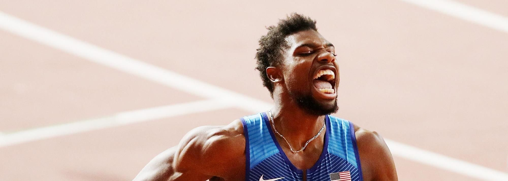

# Athletics-Data-Collection

[简体中文](./README.md) | **[English](./README-EN.md)**

Several objectives of the project:

- Set up some **active** profile pages for famous athletes (the WorldAthletics has an official profile, but I wanted to make it more **intuitive**)
- Collect competition data from Diamond League, Olympics and World Championships (probably just report cards)
- Summarize the data for each season

# Magnum opus

|  |
| :----------------------------------------------------------: |
| **[Noah Lyles' Profile](https://github.com/shadowpeng12/Athletics-Data-Collection/blob/main/Athlete/Men/Sprinter/Noah-Lyles/Profile.md)** |
|  |
| **[Letsile Tebogo's Profile](https://github.com/shadowpeng12/Athletics-Data-Collection/blob/main/Athlete/Men/Sprinter/Letsile-Tebogo/Profile.md)** |
|  |
| **[Emmanuel Wanyonyi's Profile](https://github.com/shadowpeng12/Athletics-Data-Collection/blob/main/Athlete/Men/Middle-Distance/Emmanuel-Wanyonyi/Profile.md)** |
|  |
| **[Jakob Ingebrigtsen's Profile](https://github.com/shadowpeng12/Athletics-Data-Collection/blob/main/Athlete/Men/Middle-Distance/Jakob-Ingebrigtsen/Profile.md)** |
|                                                              |