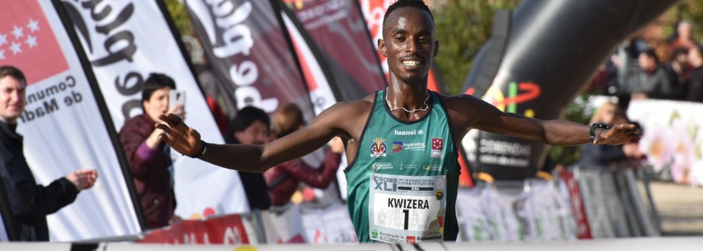

###### Athletics Information Collection 田径数据收集 *——收集田径运动员、田径赛事等信息* 在此特别鸣谢 *World Athletics`提供绝大部分数据`* *卡尔刘易斯吧`提供跳远数据`* *tilastopaja`提供未收录成绩`* *诺亚莱尔斯吧`解答疑惑`*  **在下小声**

# 收集的信息

> [!NOTE]
>
> 点击图片或者图片下面的标题文字，均可进入相应的模块

---

> 
> 
> **[现役运动员主页](#1)**
> 
> **基本上都是现在各个项目比较顶流的运动员，按照旧版田联的样式，重新制作运动员的主页**
> 
> 版面会比较简陋，但有一点好处就是查阅成绩的时候可以一览无余，不必像现在的田联版面一样，成绩需要一个个点开。
> 

> 
> 
> **[退役运动员主页](#2)**
> 
> **基本上是过去比较顶流的运动员，其中有些运动员由于年代久远，加之田联不用心维护，导致他们的一部分数据缺失**
> 
> 通过查阅资料，尽可能将这些老运动员缺失的一些数据补上，以还原老运动员真实的样子。
> 

---

> 
> 
> **[田径奖项设置](#3)**
> 
> **田联官方每年都会设置一些奖项，地方田协也设置了一些权威奖项，此外还有一些权威机构也设置了奖项**
> 
> 这里介绍历年田联的年度最佳运动员、年度最佳新星、年度最佳摄影，欧洲年度最佳运动员，《田径新闻》年度最佳运动员。
> 

> 
> 
> **[重要赛事冠军](#4)**
> 
> **收集奥运会、世锦赛、钻石联赛部分项目的冠军**
> 
> 目前暂时选择收录男子100米、200米、400米、800米、1500米的冠军，然后从决赛成绩开始，后续会逐步加入预赛、半决赛的成绩，并提供运动员主页链接。
> 

## 现役运动员的主页

|                            选手名                            |    代表国家    |    主要项目     |
| :----------------------------------------------------------: | :------------: | :-------------: |
| [诺亚·莱尔斯](./Athlete/Men/Sprinter/Noah-Lyles/Profile.md)  |      美国      |  100米、200米   |
| [莱斯利·特博格](./Athlete/Men/Sprinter/Letsile-Tebogo/Profile.md) |    博茨瓦纳    |  100米、200米   |
| [雪莉-安·弗雷泽-普莱斯](./Athlete/Women/Sprinter/Shelly-Ann-Fraser-Pryce/Profile.md) |     牙买加     |  100米、200米   |
| [伊莱恩·汤普森-赫拉](./Athlete/Women/Sprinter/Elaine-Thompson-Herah/Profile.md) |     牙买加     |  100米、200米   |
| [玛丽莱迪·保利诺](./Athlete/Women/Sprinter/Marileidy-Paulino/Profile.md) | 多米尼加共和国 |      400米      |
| [伊曼纽尔·万永伊](./Athlete/Men/Middle-Distance/Emmanuel-Wanyonyi/Profile.md) |     肯尼亚     |      800米      |
| [雅各布·英格布里格森](./Athlete/Men/Middle-Distance/Jakob-Ingebrigtsen/Profile.md) |      挪威      | 1500米、5000米  |
| [约书亚·切普特盖](./Athlete/Men/Long-Distance/Joshua-Cheptegei/Profile.md) |     乌干达     | 5000米、10000米 |

> 点击选手名，可以直接进入他们的主页
>
> 如果这些运动员退役，将被移动至退役运动员主页

## 退役运动员的主页

|                            选手名                            |  代表国家  |        主要项目         |
| :----------------------------------------------------------: | :--------: | :---------------------: |
| [卡尔·刘易斯](./Athlete/Men/Sprinter/Carl-Lewis/Profile.md)  |    美国    |   跳远、100米、200米    |
| [尤塞恩·博尔特](./Athlete/Men/Sprinter/Usain-Bolt/Profile.md) |   牙买加   |      100米、200米       |
| [迈克尔·约翰逊](./Athlete/Men/Sprinter/Michael-Johnson/Profile.md) |    美国    |      200米、400米       |
| [大卫·鲁迪沙](./Athlete/Men/Middle-Distance/David-Rudisha/Profile.md) |   肯尼亚   |          800米          |
| [希查姆·埃尔·奎罗伊](./Athlete/Men/Middle-Distance/Hicham-El-Guerrouj/Profile.md) |   摩洛哥   |     1500米、5000米      |
| [凯内尼萨·贝克勒](./Athlete/Men/Long-Distance/Kenenisa-Bekele/Profile.md) | 埃塞俄比亚 | 5000米、10000米、马拉松 |
| [艾莉森·菲利克斯](./Athlete/Women/Sprinter/Allyson-Felix/Profile.md) |    美国    |      200米、400米       |
| [叶莲娜·伊辛巴耶娃](./Athlete/Women/Jump/Yelena-Isinbayeva/Profile.md) |   俄罗斯   |        撑竿跳高         |

> 点击选手名即可进入该选手的主页

## 田径奖项一览

|                            奖项名                            |         起始年份         |
| :----------------------------------------------------------: | :----------------------: |
| [世界田联年度最佳运动员](./Awards/World-Athlete-Of-The-Year/List-simple.md) |           1988           |
| [世界田联年度最佳摄影](./Awards/Photograph-Of-The-Year/List.md) |           2017           |
|                      欧洲年度最佳运动员                      |                          |
|                      美国年度最佳运动员                      |                          |
| [《田径新闻》年度最佳运动员](./Awards/Track-And-Field-News/List-simple.md) | 1959(这里选择从1980开始) |

> 点击奖项名，可以看到该奖项的历届获奖名单。

## 重要赛事的冠军

> 由于奥运会、世锦赛赛制类似，所以这里把它们合并了。

- [历届国际田联大奖赛决赛 / 国际田联世界田径决赛 男子百米冠军](./Champion/League/Final.md)
- [历届国际田联黄金系列赛 / 国际田联黄金联赛 男子百米冠军](./Champion/League/Gold.md)
- [历年钻石联赛 男子百米冠军](./Champion/League/Diamond.md)

# THE END
